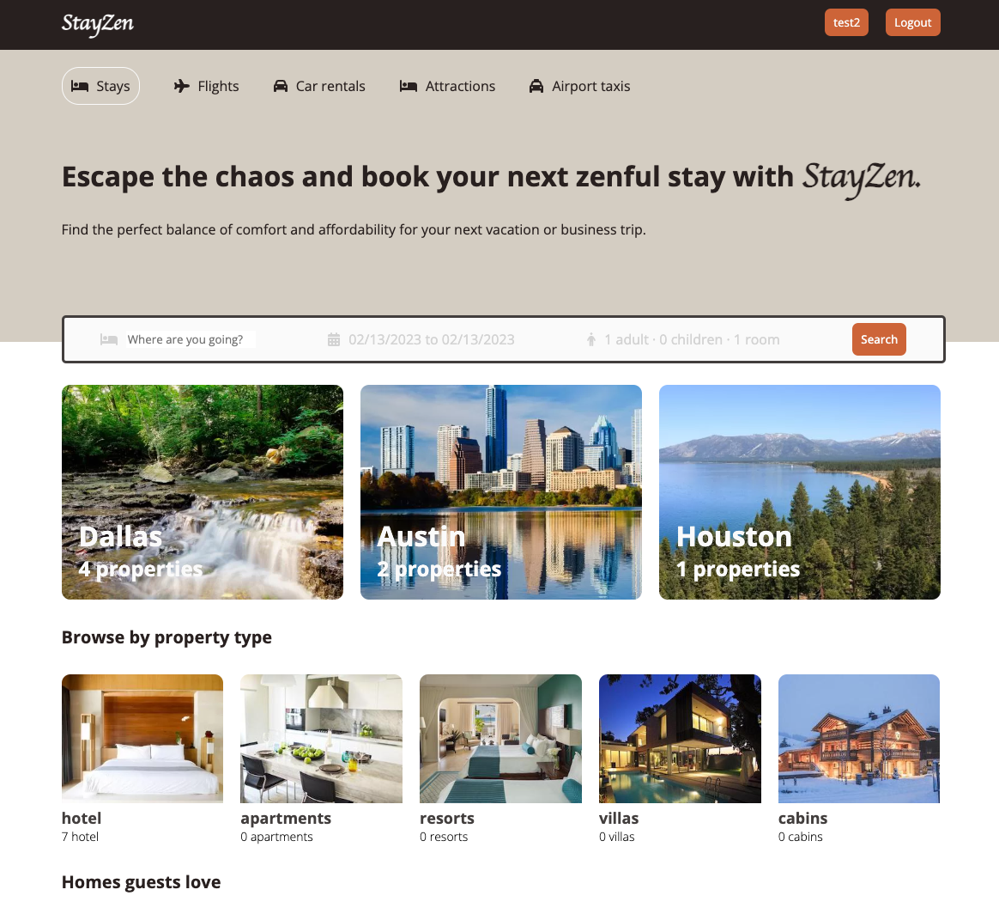
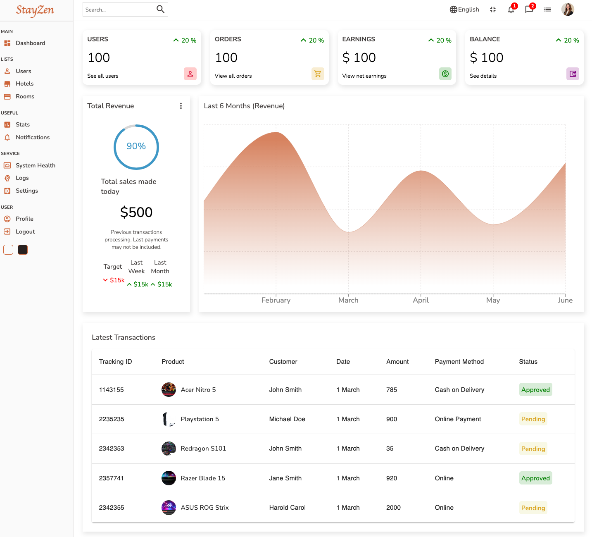

# StayZen

## Badges
---
[](https://www.javascript.com)
[](https://https://npmjs.com/)
[](https://svgshare.com/i/ZjP.svg)
[](https://github.com/Naereen/StrapDown.js/blob/master/LICENSE)

## Table of Contents:
---
- [Description](#description)
- [Installation](#installation)
- [Usage](#usage)
- [Demo](#demo)
- [Screenshots](#screenshots)
- [Features](#features)
- [License](#license)
- [Questions](#questions)

## Description:
---

- StayZen is a comprehensive and user-friendly hotel booking application that helps users find and book the perfect accommodation for their next trip. With a wide range of options and easy-to-use filters, StayZen simplifies the booking process, making it effortless to find the right fit for your needs and budget.
- Built with a modern, scalable architecture and is powered by the latest technologies to provide a seamless and efficient booking experience. The front-end is developed using React, SASS, Context API, while the back-end is built using Node.js, Express.js and MongoDB.
- Includes Admin Page: Manage the hotel's accommodations, bookings, and customer information with ease using the Admin Page, designed specifically for hotel owners.

## Installation:
---
To install this app, clone the repo first:
```
git clone git@github.com:daisyle0203/Reservation_App.git
```

## Usage:
---
After you run npm i, you should have all the dependencies that are needed to use the app. In the project directory, you can run:
```
yarn start
```
Runs the app in the development mode.
Open http://localhost:3000 to view it in your browser.

The page will reload when you make changes.
You may also see any lint errors in the console.

## Demo :
---
Check out the live application in [Heroku](https://stayzen.herokuapp.com/).

## Screenshots :
---
Main page



Admin page




## Features
---
- React (https://reactjs.org/)
- Sass (https://sass-lang.com/)
- MongoDB Atlas (https://www.mongodb.com/)
- NodeJS (https://nodejs.org/)
- ExpressJS (https://expressjs.com)


## License:
---


## Questions:
---

If you have any questions, you may contact me at either <br>
Github: https://github.com/daisyle0203
<br>
or
<br>
Email: [daisy.le0203@gmail.com](mailto:daisy.le0203@gmail.com)

---

[Top of Page](#stayzen)